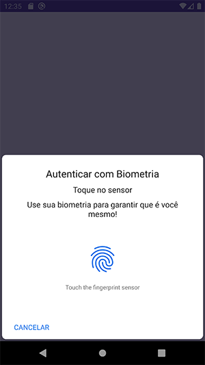

# Biometric Kotlin Util

### Como usar a Biblioteca de Biometria no Kotlin<br />

1 - Adicione a linha de url do maven no final do arquivo <b>settings.gradle.kts</b>:
```
dependencyResolutionManagement {
		repositoriesMode.set(RepositoriesMode.FAIL_ON_PROJECT_REPOS)
		repositories {
			mavenCentral()
			maven { url = uri("https://jitpack.io") }
		}
	}
```
<br /><br />
2 - Adicione a dependência no arquivo <b>build.gradle.kts</b> do seu app:
```
implementation("com.github.fylosofo:biometric-kt-utils:0.0.1")
```
<br /><br />
3 - Configure sua Activity<br />

3.1 - Faça os imports necessários:
```
import com.comecome.ktutils.BiometricAuthListener
import com.comecome.ktutils.Utils
```
<br /><br />
3.2 - Inclua a interface <b>BiometricAuthListener</b> na Activity:
```
class MainActivity: AppCompatActivity(), BiometricAuthListener {
    ....
}
```
<br /><br />
3.3 - Implemente os membros da Interface:
```
override fun onBiometricAuthenticateError(errMsg: String) {
    //Log.d("biometria","Erro: $errMsg")
    Utils.displayMessage("Erro: $errMsg", this)
}

override fun onBiometricAuthenticateSuccess() {
    //Log.d("biometria","Autenticado com sucesso!")
    Utils.displayMessage("Autenticado com sucesso!", this)
    // open activity
    val intent = Intent(this, OkActivity::class.java)
    startActivity(intent)
}
```
<br /><br />
3.4 - Chame a função <b>Utils.authBio</b> da biometria ao clicar em um botão ou imagem:
```
binding.btBiometria.setOnClickListener {
    Utils.authBio(
        "Autenticar com Biometria",
        "Toque no sensor",
        "Use sua biometria para garantir que é você mesmo!",
        "CANCELAR",
        this,
        this)
}
```
<br /><br />
## Divirta-se!!!
<br /><br />
